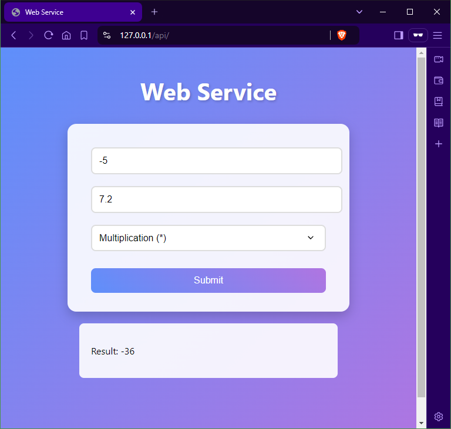
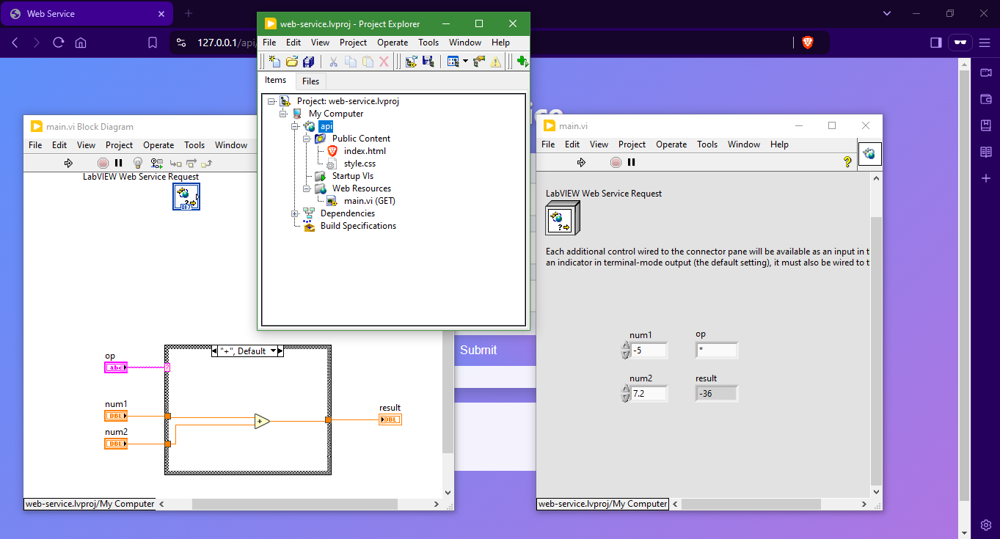

# Web Service using LabVIEW

## Description

This document provides a `LabVIEW` program that allows you to send two numbers and the operation to be performed to a web server. The server will respond with a result message that will be displayed on the web browser.

## Results

The following image shows the web browser interface of the application.

The following image shows the corresponding `LabVIEW` program.

